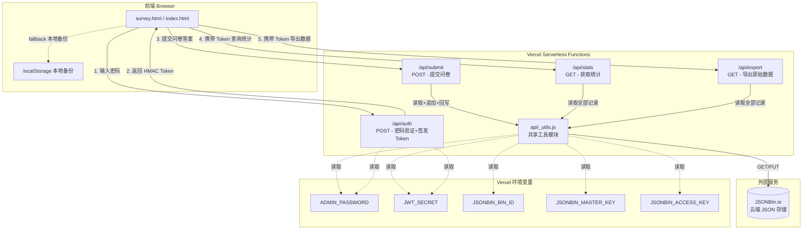
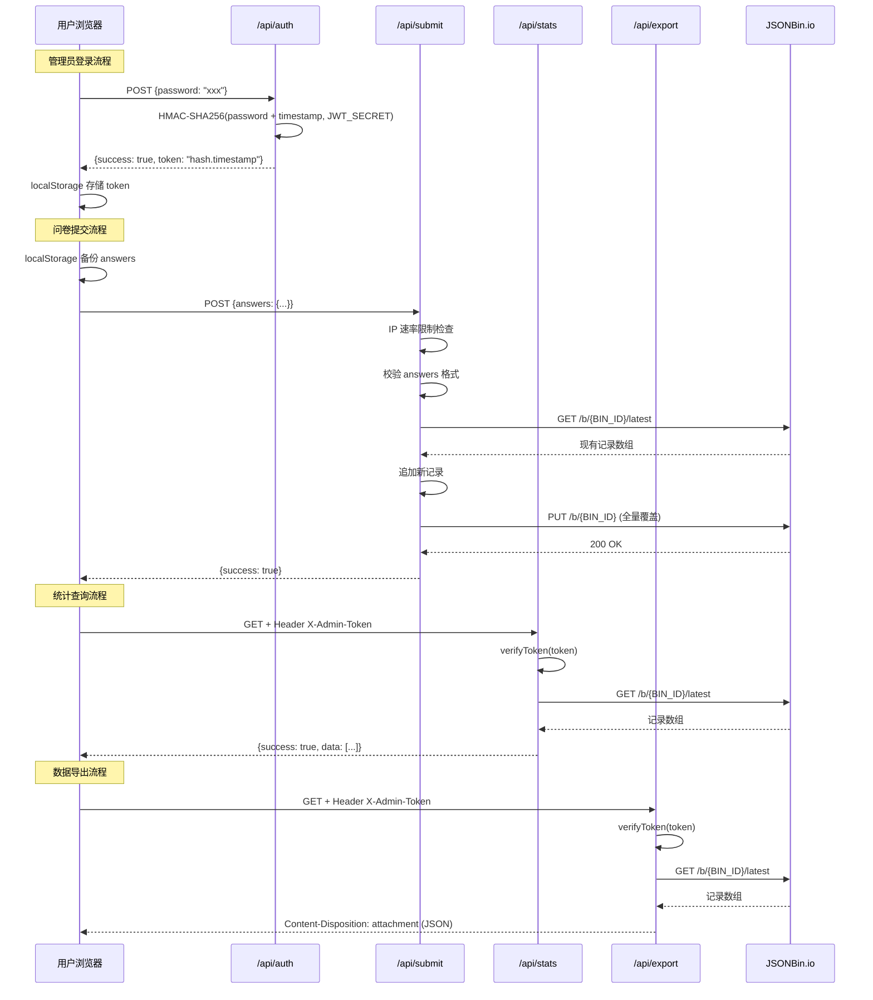

# 代码审查报告：feature/serverless vs main

## 1. 高层摘要（TL;DR）

本次变更将一个纯前端静态问卷应用（数据存储依赖客户端直连 JSONBin.io + localStorage）重构为 **Vercel Serverless 架构**，新增 5 个 Serverless Function 作为后端 API 代理层，核心目的是**将所有敏感密钥从前端代码中移除并通过服务端代理统一管理云端数据读写**，同时引入基于 HMAC 的管理员 Token 认证机制和 IP 级速率限制。

关键风险点：**当前 JSONBin.io 作为唯一数据存储后端存在严重的并发竞态条件（GET-then-PUT 无事务保护），在多用户同时提交时可能导致数据丢失；且 Token 认证方案为自定义实现，缺乏标准 JWT 的成熟度与工具生态支持。**

---

## 2. 可视化概览（代码与逻辑映射）

### 2.1 系统架构总览



### 2.2 核心请求流程



### 2.3 模块依赖关系

```mermaid
graph LR
    AUTH[auth.js] --> CRYPTO1[crypto (Node内置)]
    SUB[submit.js] --> UTILS[_utils.js]
    STATS[stats.js] --> UTILS
    EXPORT[export.js] --> UTILS

    UTILS --> CRYPTO2[crypto (Node内置)]
    UTILS --> FETCH[fetch (Node 18内置)]
    UTILS --> ENV[process.env]
```

---

## 3. 详细变更分析

### 3.1 文件清单

| 文件 | 状态 | 变更行数 | 说明 |
|------|------|----------|------|
| `api/_utils.js` | **新增** | +65 | 共享工具模块：Token 验证、JSONBin 读写、CORS 设置 |
| `api/auth.js` | **新增** | +46 | 管理员密码验证 + Token 签发 |
| `api/submit.js` | **新增** | +73 | 问卷提交接口（含 IP 速率限制） |
| `api/stats.js` | **新增** | +29 | 统计数据查询接口（需 Token） |
| `api/export.js` | **新增** | +32 | 原始数据导出接口（需 Token） |
| `package.json` | **新增** | +11 | 项目元数据 + Node 版本约束 |
| `.gitignore` | **新增** | +17 | 忽略 node_modules、.env、.vercel 等 |
| `survey.html` | **修改** | -72/+50 | 前端 JS 重构：移除 JSONBin 直连，改用 API 调用 |
| `index.html` | **修改** | 同 survey.html | 与 survey.html 同步修改（内容一致） |
| `部署指南.md` | **修改** | 重写 | 从 GitHub Pages 优先改为 Vercel 优先，新增环境变量说明 |

**统计汇总**：10 个文件变更，526 行新增，269 行删除。

---

### 3.2 逐文件详细分析

#### 3.2.1 `api/_utils.js`（新增 - 共享工具模块）

**职责**：提供所有 Serverless Function 共用的工具函数。

**变更点与实现方式**：

| 函数/常量 | 职责 | 输入 | 输出 | 备注 |
|-----------|------|------|------|------|
| `BIN_ID` 等 5 个常量 | 从 `process.env` 读取环境变量 | - | string/undefined | 启动时校验完整性 |
| `verifyToken(token)` | 验证管理员 HMAC Token | string (hash.timestamp) | boolean | 1小时过期 |
| `fetchCloudData()` | 从 JSONBin 获取全部记录 | - | Promise\<Array\> | 过滤 `_init` 占位记录 |
| `saveToCloud(newRecord)` | 追加记录到 JSONBin | object | Promise\<boolean\> | GET-then-PUT 全量覆盖 |
| `setCors(res)` | 设置 CORS 响应头 | HTTP Response | void | 允许所有来源 |

**关键逻辑 -- Token 验证**：
```
token 格式: "{hmac_hash}.{timestamp}"
验证步骤:
1. 按 '.' 分割得到 hash 和 timestamp
2. 用 JWT_SECRET 重新计算 HMAC-SHA256(ADMIN_PASSWORD:timestamp)
3. 比对计算结果与 token 中的 hash
4. 检查 timestamp 距今是否超过 3600000ms (1小时)
```

**关键逻辑 -- 云端数据保存**：
```
saveToCloud(record):
1. 调用 fetchCloudData() 获取当前全部记录
2. 若数组为空，插入 _init 占位记录（JSONBin 拒绝空数组）
3. 追加新记录
4. PUT 全量回写到 JSONBin
```

---

#### 3.2.2 `api/auth.js`（新增 - 认证接口）

**职责**：验证管理员密码并签发临时 Token。

**路由**：`POST /api/auth`

**请求体**：`{ password: string }`

**响应**：
- 成功 (200)：`{ success: true, token: "hash.timestamp" }`
- 密码错误 (401)：`{ success: false, message: "密码错误" }`
- 方法不允许 (405)：`{ success: false, message: "Method not allowed" }`
- 未配置 (500)：`{ success: false, message: "Server not configured" }`

**关键实现**：
- `generateToken()`：使用 `crypto.createHmac('sha256', JWT_SECRET)` 对 `ADMIN_PASSWORD:timestamp` 进行签名
- 支持 OPTIONS 预检请求
- 环境变量缺失时返回 500 而非崩溃

---

#### 3.2.3 `api/submit.js`（新增 - 提交接口）

**职责**：接收问卷答案并保存到 JSONBin 云端。

**路由**：`POST /api/submit`

**请求体**：`{ answers: object }`

**响应**：
- 成功 (200)：`{ success: true }`
- 速率限制 (429)：`{ success: false, message: "提交过于频繁，请稍后再试" }`
- 参数无效 (400)：`{ success: false, message: "Invalid answers data" }`
- 服务器错误 (500)：`{ success: false, message: "Server error" }`

**关键实现 -- 内存级速率限制**：
```
数据结构: Map<string, {count: number, startTime: number}>
- 键: IP 地址 (从 x-forwarded-for 或 remoteAddress 获取)
- 限制: 每个 IP 每分钟最多 3 次提交
- 清理: 每 5 分钟清除超过 2 倍窗口期的记录
```

**关键实现 -- 记录格式**：
```json
{
  "timestamp": "2026-07-02T12:00:00.000Z",
  "answers": { "q1": "是", "q2": "拥有并经常使用", ... }
}
```

---

#### 3.2.4 `api/stats.js`（新增 - 统计接口）

**职责**：获取全部问卷数据供前端渲染统计。

**路由**：`GET /api/stats`

**认证**：需要 `X-Admin-Token` 请求头

**响应**：
- 成功 (200)：`{ success: true, data: [...] }`
- 未授权 (401)：`{ success: false, message: "Unauthorized" }`

---

#### 3.2.5 `api/export.js`（新增 - 导出接口）

**职责**：以 JSON 文件形式导出全部原始数据。

**路由**：`GET /api/export`

**认证**：需要 `X-Admin-Token` 请求头

**响应**：
- 成功 (200)：`Content-Type: application/octet-stream`，`Content-Disposition: attachment; filename="survey_data.json"`
- 未授权 (401)：`{ success: false, message: "Unauthorized" }`

**注意**：导出接口直接发送 JSON 字符串而非 JSON 对象，前端通过 `res.json()` 解析后再创建 Blob 下载。

---

#### 3.2.6 `survey.html` / `index.html`（修改 - 前端重构）

**核心变更点**：

| 变更项 | 旧实现 (main) | 新实现 (feature/serverless) |
|--------|---------------|------------------------------|
| API 常量 | `ADMIN_PASSWORD = 'gz2024survey'`，`JSONBIN_CONFIG` 含密钥 | `API_BASE = '/api'`，无密钥 |
| 云端存储 | 前端直连 JSONBin.io（密钥暴露在前端） | 通过 `/api/submit` 代理 |
| 管理员认证 | 前端直接比对硬编码密码 | 调用 `/api/auth` 服务端验证 |
| Token 管理 | 无 | `adminToken` 存储在 localStorage |
| 统计加载 | `getAllData()` = 先取云端再降级 localStorage | `fetch('/api/stats')` + localStorage 降级 |
| 数据导出 | 前端直接读 localStorage/云端数据生成 Blob | `fetch('/api/export')` 从服务端获取 |
| 本地备份 | `saveSurveyData(entry)` 追加到数组 | `localStorage.setItem` 直接覆盖（仅保存最近一次） |

**前端关键函数变更**：

- `submitSurvey()`：从调用 `saveToCloud(entry)` 改为 `fetch('/api/submit')`；本地备份方式从 `saveSurveyData(entry)`（追加式）变为 `localStorage.setItem`（覆盖式）
- `checkAdminPassword()`：从同步函数改为 `async`，调用 `/api/auth` 进行服务端验证
- `loadAndRenderStats()`：从 `getAllData()` 改为 `fetch('/api/stats')`，失败时降级到 localStorage
- `exportJSON()`：从直接读本地/云端数据改为调用 `/api/export`

**删除的函数**：
- `fetchCloudData()` - 前端直连 JSONBin 获取数据
- `saveToCloud()` - 前端直连 JSONBin 保存数据
- `getAllData()` - 合并云端和本地数据的聚合函数
- `saveSurveyData()` - 追加式 localStorage 写入

---

#### 3.2.7 `package.json`（新增）

```json
{
  "name": "gz-ebike-survey",
  "version": "0.1.0",
  "private": true,
  "engines": { "node": ">=18.x" },
  "scripts": { "dev": "vercel dev" }
}
```

**说明**：声明项目名、Node.js 版本要求 (>=18，因使用了 Node 18 内置的 `fetch`)、开发命令 `vercel dev`。

---

#### 3.2.8 `.gitignore`（新增）

忽略内容：`.uploads/`、`node_modules/`、`.env*`、`.vercel/`、OS 系统文件。

**说明**：防止敏感环境变量文件和 Vercel 配置被提交到仓库。

---

#### 3.2.9 `部署指南.md`（修改）

**主要变更**：
- 部署优先级从 "GitHub Pages > Vercel > Netlify" 改为 "Vercel > GitHub Pages > Netlify"
- 新增 Vercel 环境变量配置说明（5 个必需变量）
- 新增 Serverless API 架构说明和安全设计说明
- 新增分支对比表（main vs feature/serverless）
- 新增 FAQ：微信链接拦截、平台切换
- 更新分享文案中的时间估计（4-5 分钟改为 5-6 分钟，题目数 18 改为 19）

---

### 3.3 数据结构

`questions.json` 定义了 18 道题目（5 个部分），数据结构如下：

```json
{
  "id": "q1",
  "part": "第一部分：基本信息",
  "type": "radio | checkbox | checkbox_limit | likert | text",
  "title": "题目标题",
  "required": true,
  "options": ["选项1", "选项2"],
  "labels": ["标签1", "标签2"],
  "maxSelect": 3,
  "mutuallyExclusive": [6, 7]
}
```

**提交数据格式**（保存到 JSONBin）：
```json
{
  "timestamp": "2026-07-02T12:00:00.000Z",
  "answers": {
    "q1": "是",
    "q4": ["日常通勤上下班", "购物办事"],
    "q18": "文字建议内容"
  }
}
```

---

## 4. 影响与风险评估

### 4.1 功能影响

| 影响范围 | 说明 |
|----------|------|
| 问卷提交 | 从前端直连 JSONBin 改为服务端代理，用户体验基本不变，但增加了网络跳转 |
| 管理员认证 | 从硬编码密码前端比对改为服务端验证 + Token 机制，认证更安全但依赖网络 |
| 统计查看 | 需要先通过网络认证获取 Token，再请求统计数据；离线时降级到 localStorage |
| 数据导出 | 从前端直接生成文件改为通过 API 下载，依赖网络 |
| 本地备份 | 从追加式（保留历史）变为覆盖式（仅保留最近一次），本地数据可能丢失历史记录 |

### 4.2 质量风险

| 风险 | 等级 | 说明 |
|------|------|------|
| **并发竞态条件** | **高** | `saveToCloud()` 采用 GET-then-PUT 全量覆盖模式，无任何锁机制。当两个用户同时提交时，后执行 PUT 的用户会覆盖前一个用户的提交数据，导致**数据丢失**。JSONBin.io 不支持原子追加操作。 |
| **内存速率限制不可扩展** | **中** | `submit.js` 使用 `Map` 实现的内存级速率限制在 Serverless 环境中，每个函数实例独立维护状态。Vercel 可能在短时间内创建多个实例，导致速率限制形同虚设。 |
| **无数据校验深度** | **中** | `submit.js` 仅检查 `answers` 是否为对象，未校验题目 ID 合法性、必填字段完整性、选项值是否在合法范围内，可被提交恶意或无效数据。 |
| **stats 和 export 功能重叠** | **低** | 两个接口都调用 `fetchCloudData()` 获取全量数据，仅返回格式不同（JSON vs 下载流）。可考虑合并或让 export 复用 stats 的逻辑。 |
| **index.html 与 survey.html 同步问题** | **低** | 两个 HTML 文件内容几乎完全相同，后续维护时极易出现修改遗漏导致不一致。 |

### 4.3 业务风险

| 风险 | 等级 | 说明 |
|------|------|------|
| **依赖 JSONBin.io 单点故障** | **中** | 所有数据存储在第三方服务 JSONBin.io 上，该服务免费版有限制（请求频率、数据大小），若服务不可用则问卷无法正常提交。 |
| **数据量增长导致性能下降** | **中** | `fetchCloudData()` 每次获取全量数据，`saveToCloud()` 全量回写。随着提交量增加，请求体增大，响应时间线性增长，可能触发 Vercel Function 超时限制（默认 10 秒）。 |
| **本地备份策略退化** | **低** | main 分支使用 `saveSurveyData()` 将每次提交追加到 localStorage 数组中，serverless 分支改为直接覆盖 `localStorage.setItem('gz_ebike_survey_data', JSON.stringify(answers))`，本地只保留最近一次提交的数据，历史数据丢失。 |
| **无数据备份/恢复机制** | **中** | 无定期备份机制，若 JSONBin 数据被误删或损坏，无法恢复。 |

### 4.4 性能风险

| 风险 | 等级 | 说明 |
|------|------|------|
| **每次提交触发两次 JSONBin API 调用** | **中** | `saveToCloud()` 内部先 GET 再 PUT，加上外部的 submit 请求，每次提交需要 3 次网络往返。 |
| **全量数据传输** | **中** | 无论 stats 还是 export，每次请求都传输 JSONBin 中的全部记录。当数据量达到数百条以上时，响应体较大。 |
| **Serverless 冷启动** | **低** | Vercel Serverless Functions 在首次调用时可能有冷启动延迟（约 100-500ms），对用户体验有轻微影响。 |

### 4.5 安全风险

| 风险 | 等级 | 说明 |
|------|------|------|
| **自定义 Token 方案缺乏成熟度** | **中** | 使用自定义 HMAC Token 而非标准 JWT。自定义方案缺少标准的过期声明、签发者信息等元数据，且 `ADMIN_PASSWORD` 作为签名输入的一部分意味着密码变更会使所有已签发 Token 立即失效（这一点本身是好的），但也增加了攻击面——若 Token 泄露，攻击者可在 1 小时内访问统计和导出接口。 |
| **CORS 设置过于宽松** | **中** | `setCors()` 设置 `Access-Control-Allow-Origin: *`，允许任何域名的网页调用 API。虽然统计和导出接口需要 Token 保护，但提交接口 (`/api/submit`) 完全公开，可被任意第三方网站 CSRF 攻击利用，自动向问卷提交垃圾数据。 |
| **无 HTTPS 强制** | **低** | 代码中未强制 HTTPS。不过 Vercel 默认提供 HTTPS，实际风险较低。 |
| **密码明文传输** | **低** | `/api/auth` 接口以明文形式接收和比对密码，未使用 bcrypt 等哈希算法。密码仅在内存中比对不落库，在 HTTPS 下可接受，但若环境变量中密码为弱密码则存在暴力破解风险（接口无登录失败次数限制）。 |
| **错误信息泄露** | **低** | 部分 catch 块返回 `err.message` 给前端（如 stats 接口的 `data.message`），可能泄露内部实现细节。submit 接口已正确处理（仅返回通用 "Server error"）。 |
| **adminToken 存储在 localStorage** | **低** | Token 存储在 localStorage 中，容易受到 XSS 攻击窃取。不过该项目为纯静态页面，XSS 风险面较小。 |

---

## 5. 总结与建议

### 5.1 优点

1. **安全性显著提升**：核心改进在于将所有敏感密钥（JSONBin Master Key、Access Key、管理员密码）从前端代码中彻底移除，消除了 main 分支中密钥直接暴露在浏览器源码中的严重安全隐患。
2. **架构清晰**：API 路径设计合理，RESTful 风格统一，各函数职责单一，`_utils.js` 作为共享模块减少了代码重复。
3. **降级机制**：统计加载在 API 不可用时降级到 localStorage 数据，提升了可用性。
4. **速率限制意识**：在提交接口中引入了 IP 级速率限制，体现了防滥用意识。
5. **环境变量校验**：启动时检查必需环境变量是否完整配置，便于快速排查配置问题。
6. **部署文档完善**：部署指南详尽，包含环境变量配置表、API 架构说明、FAQ 等。

### 5.2 必须修复问题

#### 高优先级

| # | 问题 | 文件 | 建议 |
|---|------|------|------|
| H1 | **并发竞态条件 -- 数据丢失风险** | `api/_utils.js:39-57` | 引入乐观锁或版本号机制（如 ETag/If-Match），或在 JSONBin 中使用独立的 Append-only Bin 替代全量覆盖。也可考虑在 `saveToCloud` 中加入重试逻辑：GET 后比对版本，若版本不一致则重新 GET 并合并后再 PUT。 |
| H2 | **CORS 允许任意来源 -- CSRF 风险** | `api/_utils.js:59-63` | 将 `Access-Control-Allow-Origin` 限制为部署域名（如从环境变量读取 `ALLOWED_ORIGIN`）。或在 `/api/submit` 中增加 CSRF Token 机制（如检查 `Origin`/`Referer` 头）。 |

#### 中优先级

| # | 问题 | 文件 | 建议 |
|---|------|------|------|
| M1 | **内存速率限制在 Serverless 环境下失效** | `api/submit.js:4-33` | 改用 Vercel KV（Redis）或 Upstash Redis 等持久化存储实现速率限制，或使用 Vercel 平台内置的 Rate Limiting 功能。 |
| M2 | **提交数据缺少业务校验** | `api/submit.js:56-58` | 在服务端加载 `questions.json` 并校验：字段 ID 合法性、必填字段非空、选项值在合法范围内、字段类型正确。拒绝不符合题目定义的提交。 |
| M3 | **本地备份从追加式退化为覆盖式** | `survey.html:1175` | 将 `localStorage.setItem('gz_ebike_survey_data', JSON.stringify(answers))` 改为追加式写入，保持与 main 分支一致的行为：`saveSurveyData({ timestamp, answers })`。 |
| M4 | **全量读写随数据量增长不可持续** | `api/_utils.js:28-57` | 当数据量增长时考虑分页查询或迁移到更合适的数据库（如 Vercel Postgres、PlanetScale、Cloudflare D1）。短期可在 `fetchCloudData` 中添加数据量监控和告警。 |
| M5 | **admin 接口无暴力破解保护** | `api/auth.js:38-45` | 增加基于 IP 的登录失败次数限制（如 5 次失败后锁定 15 分钟），防止暴力破解管理员密码。 |

#### 低优先级

| # | 问题 | 文件 | 建议 |
|---|------|------|------|
| L1 | **index.html 与 survey.html 内容重复** | `index.html`, `survey.html` | 将公共 HTML 提取为模板，或删除其中一个文件并配置重定向，避免维护同步问题。 |
| L2 | **export 接口前端解析方式不一致** | `survey.html:1396-1416` | export 接口返回 `Content-Type: application/octet-stream` 但前端使用 `res.json()` 解析。建议服务端统一返回 JSON（与 stats 一致），由前端负责生成文件下载；或服务端直接返回文件流并使用 `res.blob()` 前端处理。 |
| L3 | **自定义 Token 方案可替换为标准 JWT** | `api/_utils.js:15-26`, `api/auth.js:10-16` | 考虑使用 `jsonwebtoken` 库签发标准 JWT，包含 `exp`、`iat`、`sub` 等标准声明，便于调试、工具链支持和未来扩展。 |
| L4 | **错误消息中可能泄露内部细节** | `api/stats.js:27` | 统一所有 catch 块返回通用错误消息 `"Server error"`，将详细错误仅输出到 `console.error`。 |

### 5.3 优化建议

1. **引入 CI/CD 检查**：为 API 函数添加单元测试，特别是 `verifyToken`、`isRateLimited`、`saveToCloud` 等核心逻辑。可在 GitHub Actions 中配置自动测试。

2. **添加请求日志**：在 submit 接口中记录每次提交的 IP、时间戳、题目数量等基本信息（不记录具体答案），便于监控异常提交行为。

3. **统一响应格式**：建议所有 API 使用一致的响应包装格式，如 `{ success, data?, message?, error? }`，并定义 TypeScript 接口或 JSON Schema。

4. **考虑使用 Vercel KV 替代 JSONBin**：Vercel KV（基于 Redis）与 Vercel 平台深度集成，支持原子操作（如 LPUSH/RPUSH 追加数据），天然解决并发竞态问题，且无需暴露第三方密钥。

5. **为 API 添加健康检查端点**：增加 `GET /api/health` 用于监控服务状态，检查 JSONBin 连通性和环境变量配置完整性。

6. **前端添加网络错误重试机制**：对于关键操作（提交问卷），在前端实现自动重试（如最多 3 次，间隔递增），提升网络不稳定场景下的成功率。
